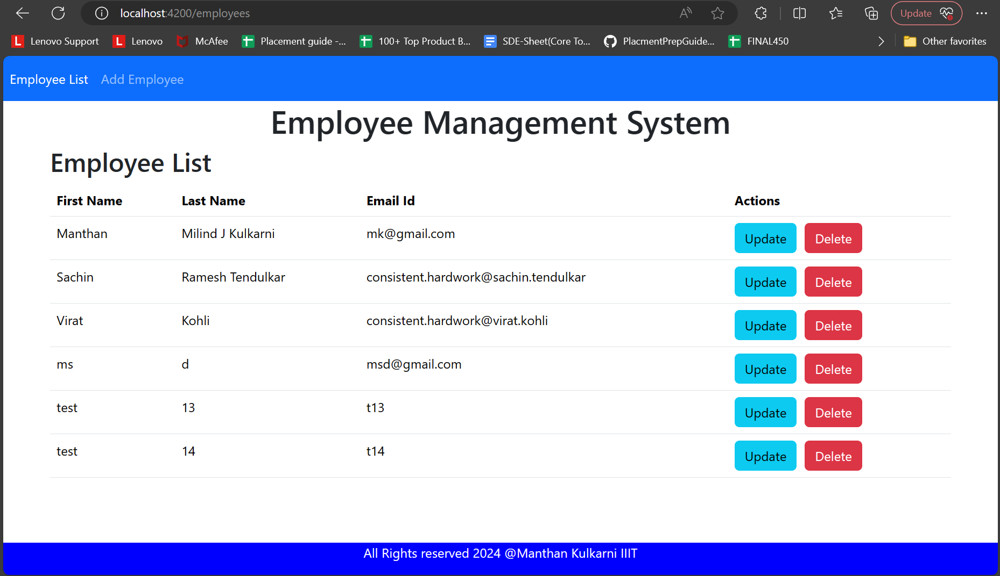
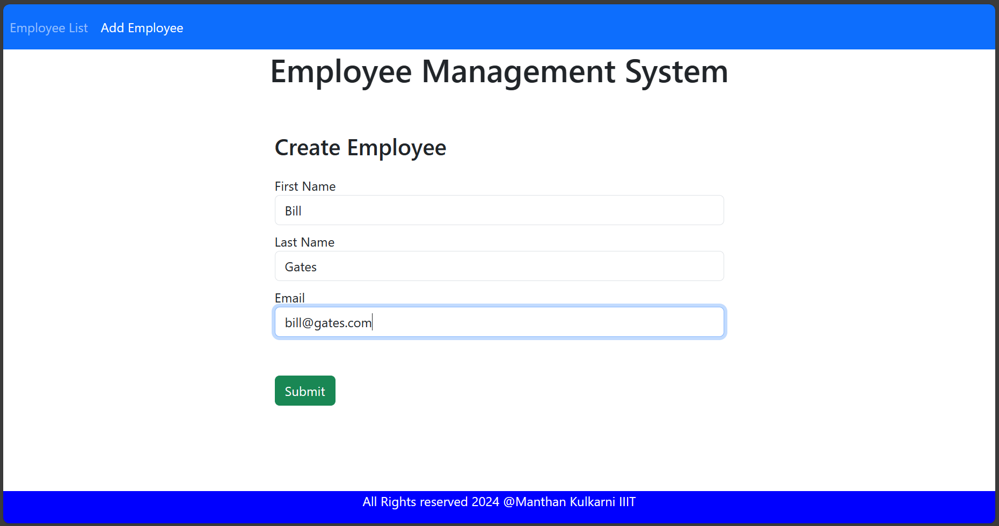
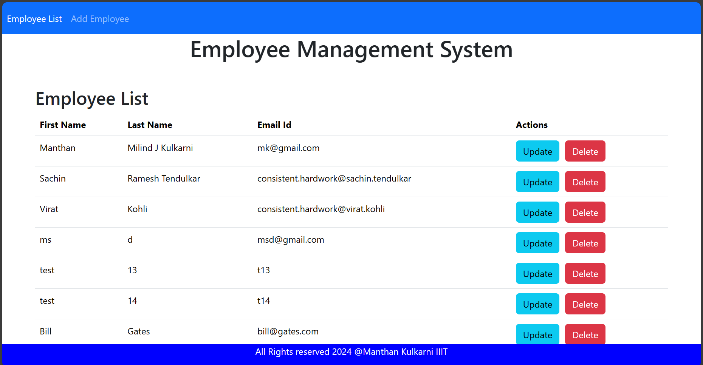
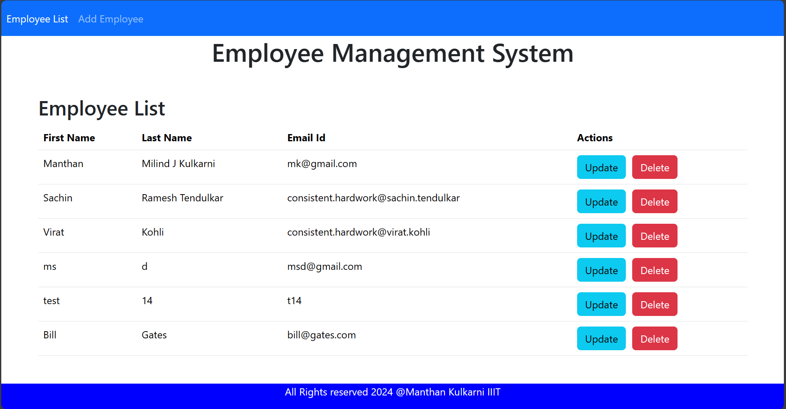
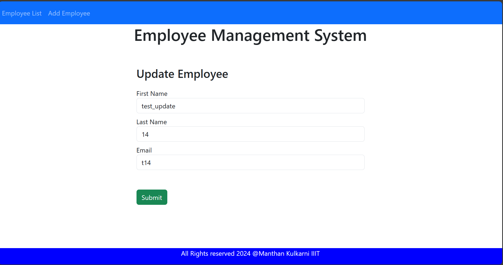
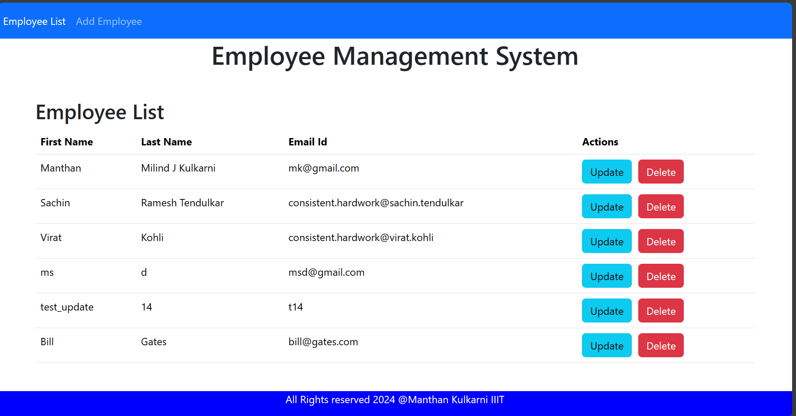

# Angular Frontend
## Employee Management System
## All Employees List

## Create or Add Employee Data

## After Adding Employee

## Delete Employee (test13)

## Update Employee

## After Updating Employee

